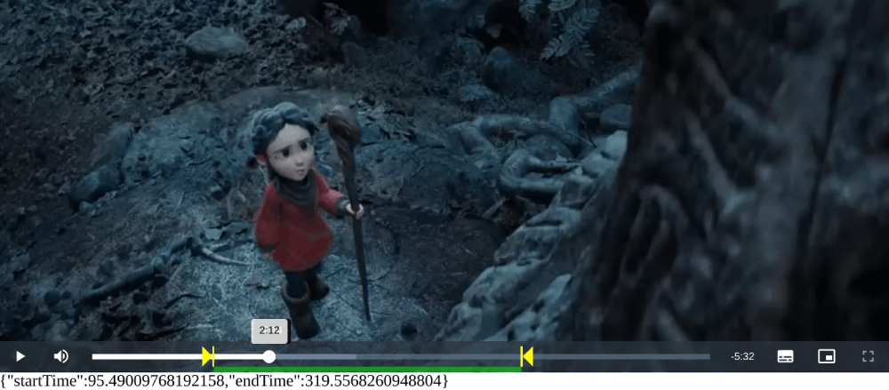

# Video.js Trimmer Plugin

The Video.js Popups Plugin adds visual trimming functionality to videos loaded using Video.js. It allows users to select a specific time range within the video using a visual trimming bar on the video player.



## Compatibility

This plugin version is compatible with Video.js v8.x.

## Getting Started

### Prerequisites

Make sure you have [Video.js](https://videojs.com/) installed in your project before using this plugin.

### Installation

Include the Video.js library and the `videojs-popups` files in your HTML file:

```html
<!-- Video.js library -->
<link href="https://vjs.zencdn.net/8.6.1/video-js.css" rel="stylesheet"/>
<script src="https://vjs.zencdn.net/8.6.1/video.min.js"></script>

<!-- Video.js Trimmer plugin -->
<!--dependency-->
<script src="https://cdn.jsdelivr.net/npm/videojs-offset@2.1.3/dist/videojs-offset.min.js"></script>
<!--dependency-->
<link href="https://cdn.jsdelivr.net/gh/Teyuto/videojs-trimmer@main/src/videojs-trimmer.min.css" rel="stylesheet"/>
<script src="https://cdn.jsdelivr.net/gh/Teyuto/videojs-trimmer@main/src/videojs-trimmer.min.js"></script>
```

### Usage

Initialize Video.js as you normally would and add the Video.js Popups Plugin:

```javascript
// Create a video player
var player = videojs('my-video');

// Activate the Video JS Trimmer plugin
player.trimmer();

// Optional: Handle event to monitor trimming changes
player.on('trimmerchange', function(event, data) {
    console.log('Trimming interval changed:', data.startTime, 's -', data.endTime, 's');
});
```

Make sure to replace `'my-video'` with your actual video player ID.

## Example
Check the provided HTML `examples/index.html` file for a working example.

## License

This project is licensed under the MIT License - see the [LICENSE.md](LICENSE.md) file for details.

---